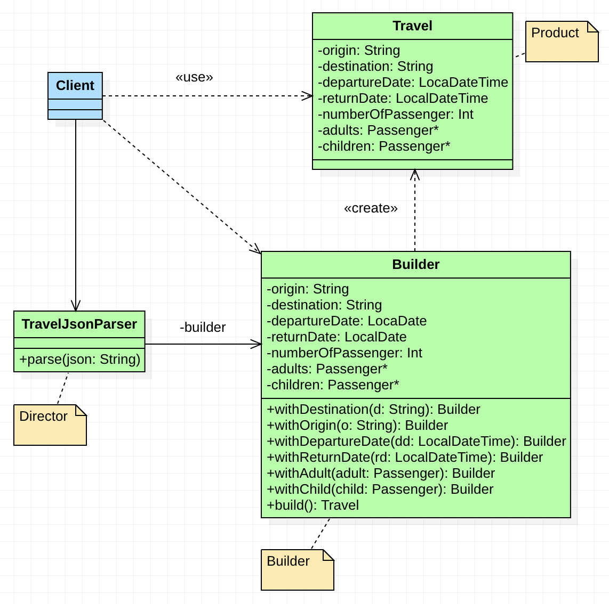
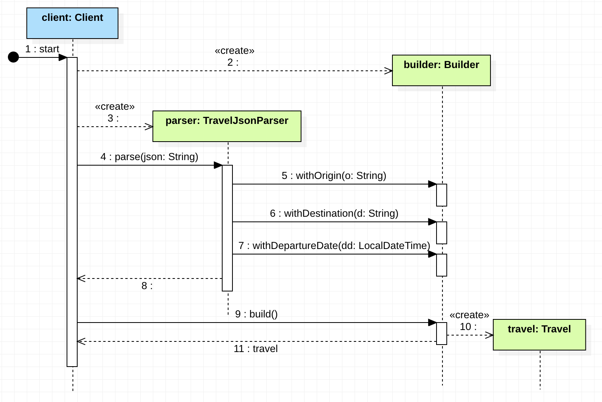

## Introduction

It's been 30 years since the Gang of Four published their seminal book on design patterns, called "Design Patterns: Elements of Reusable Object-Oriented Software". In the last three decades, the software industry has evolved significantly, and so have the best practices and patterns that we use to build software. Are the design patterns from the 90s still relevant today? Many software engineers would argue that they are not. In this series of articles, we will revisit some of the most popular design patterns and see how they evolved over time and which is the real legacy they left us. Since we have to start somewhere, let's start with the Builder Pattern.

## The Problem

In the book "[Design Patterns: Elements of Reusable Object-Oriented Software](https://books.google.it/books/about/Design_Patterns.html?id=6oHuKQe3TjQC&redir_esc=y)", each pattern describes a problem that occurs over and over again in our environment, and then describes the core of the solution to that problem, in such a way that you can use this solution a million times over, without ever doing it the same way twice. So, before we dive into the Builder Pattern, let's first understand the problem it tries to solve.

Imagine you have a complex object that you need to create. This object has many properties, some of which are mandatory, and some are optional. We could even have different flavors of the same object, with diffeerent properties. Let's make a concrete example.

Imagine we have to model a travel solution. A `Travel` is a very complex object, with many properties and constraint. Let's use the Java language to model it for now:

```java
public record Travel(
    String origin,
    String destination,
    LocalDateTime departureDate,
    LocalDateTime returnDate,
    int numberOfPassengers,
    List<Passenger> adults,
    List<Passenger> children
) {}

public record Passenger(
    String name,
    LocalDateTime birthDate,
    String passportNumber
    List<Ancillary> ancillaries
) {}

public record Ancillary(
    String name,
    Cost cost
) {}

public record Cost(
    BigDecimal amount,
    Currency currency
) {}

public enum Currency {
    USD,
    EUR,
    GBP
}
```

Even in this simple example, we can see that creating a `Travel` object is not trivial. We have many properties, some of which are mandatory, and some are optional. For example, a travel can be one-way or round-trip, and we have to specify the number of passengers, the list of adults, the list of children, and the list of ancillaries. The `Passenger` and `Ancillary` objects are also complex objects, with their own properties.

One-way flights don't have a `returnDate`, for example, so we could create a new constructor reflecting this fact:

```java
public record Travel(
    String origin,
    String destination,
    LocalDateTime departureDate,
    LocalDateTime returnDate,
    int numberOfPassengers,
    List<Passenger> adults,
    List<Passenger> children) {

    // Constructor for one-way flights
    public Travel(
        String origin,
        String destination,
        LocalDateTime departureDate,
        int numberOfPassengers,
        List<Passenger> adults,
        List<Passenger> children) {

        this(origin, destination, departureDate, null, numberOfPassengers, adults, children);
    }
}
```

As you see the constructor for the one-way flight is just a copy of the original constructor with the `returnDate` parameter set to `null`. We can reiterate the reasoning and create a new constructor for the round-trip flights that has only adults as passengers:

```java
public record Travel(
    String origin,
    String destination,
    LocalDateTime departureDate,
    LocalDateTime returnDate,
    int numberOfPassengers,
    List<Passenger> adults,
    List<Passenger> children) {

    // Constructor for one-way flights
    public Travel(
        String origin,
        String destination,
        LocalDateTime departureDate,
        int numberOfPassengers,
        List<Passenger> adults,
        List<Passenger> children) {

        this(origin, destination, departureDate, null, numberOfPassengers, adults, children);
    }

    // Constructor for round-trip flights with only adults
    public Travel(
        String origin,
        String destination,
        LocalDateTime departureDate,
        LocalDateTime returnDate,
        int numberOfPassengers,
        List<Passenger> adults) {

        this(origin, destination, departureDate, returnDate, numberOfPassengers, adults, List.of());
    }
}
```

We can stop here, but we can see that the number of constructors will grow exponentially with the number of optional properties. The one problem we have here is called constructor telescoping. The constructor telescoping anti-pattern occurs when a class has multiple constructors, each calling a more specific constructor in the hierarchy, with the last one calling all the others. This is a common problem in object-oriented programming, and it can make the code hard to read and maintain.

Another problem we have here is that we have many different properties that have the same type. For example, origin and destination are both strings, and departureDate and returnDate are both `LocalDateTime`. This can lead to confusion when creating the object. Look at the following client code that creates a `Travel` object for a trip from Milan to New York, departing on October 1st, 2025, and returning on October 15th, 2025, with two passengers, John Doe and Jane Doe:

```java
Travel travel = new Travel(
    "Milan",
    "New York",
    LocalDateTime.of(2025, 10, 15),
    LocalDateTime.of(2025, 10, 1),
    2,
    List.of(
        new Passenger(
            "John Doe",
            LocalDateTime.of(1980, 1, 1),
            "123456789",
            List.of(
                new Ancillary(
                    "Extra Baggage",
                    new Cost(BigDecimal.valueOf(50), Currency.EUR)
                )
            )
        )
    ),
    List.of(
        new Passenger(
            "Jane Doe",
            LocalDateTime.of(1985, 1, 1),
            "987654321",
            List.of(
                new Ancillary(
                    "Extra Legroom",
                    new Cost(BigDecimal.valueOf(100), Currency.EUR)
                )
            )
        )
    )
);
```

Everything's fine, isn't it? I guess many of you didn't notice that the `departureDate` and `returnDate` are swapped. This is a common mistake that can happen when creating complex objects with many properties of the same type. It's hard to remember the order of the properties, and it's easy to make mistakes, also because we don't have any labels to help us remember the order of the properties.

Another best practice to keep in mind is that we should not expose the internal details of an object to the client code. In particular, we don't want the client code to know the logic of how the object is created. Any validation logic, default values, or constraints should be hidden from the client code. Let's deliberately validate the `Travel` object in the client code:

```java
var travel = Travel(/* ... */)
if (travel.origin() == null) {
    throw new IllegalArgumentException("Origin is required");
}
if (travel.destination() == null) {
    throw new IllegalArgumentException("Destination is required");
}
if (travel.departureDate() == null) {
    throw new IllegalArgumentException("Departure date is required");
}
// ...and so on
```

If we leave the creation of the `Travel` object to the client code, we will end up with a lot of boilerplate code, and the client code will be tightly coupled with the `Travel` object. We will copy and paste the same code over and over again, and if we need to change the `Travel` object, we will have to change all the client code that creates it.
Nevertheless, it's a violation of the DRY (Don't Repeat Yourself) principle.

 We should avoid to create invalid objects in the first place, and we should not expose the internal details of the object to the client code. Then, we can move the validation logic inside the `Travel` primary constructor:

```java
public record Travel(
    String origin,
    String destination,
    LocalDateTime departureDate,
    LocalDateTime returnDate,
    int numberOfPassengers,
    List<Passenger> adults,
    List<Passenger> children
) {
    // Compact constructor
    public Travel {
        if (origin == null) {
            throw new IllegalArgumentException("Origin is required");
        }
        if (destination == null) {
            throw new IllegalArgumentException("Destination is required");
        }
        if (departureDate == null) {
            throw new IllegalArgumentException("Departure date is required");
        }
        // ...and so on
    }
}
```

However, as we said, we can have both a one-way and a round-trip flight, we need different validation logic for each case. So, we can't put the validation logic inside the primary constructor.

In the mid 90s, the Builder Pattern was introduced to solve the above problems with the technologies of the time. Let's see how it works.

## Ladies and Gentlemen, the Builder Pattern

The builder pattern addresses quite all the problems we have seen so far. We can cite the book of the Gang of Four to define the pattern:

> Separate the construction of a complex object from its representation so that the same construction process can create different representations.

Let's tackle the definition one sentence at time. The first one says that we need to separate the construction of a complex object from its representation. We can call the object we can build the product of the building process. In our scenario, the product represents the `Travel` class. To adhere to the first part of the definition, we need to avoid clients of the product to build (or instantiate) the product directly. So, first of all, we need to make the `Travel` constructor private. Since `record` classes in Java don't allow private constructors, we must turn the `Travel` type into a regular class:

```java
public class Travel {
    private final String origin;
    private final String destination;
    private final LocalDateTime departureDate;
    private final LocalDateTime returnDate;
    private final int numberOfPassengers;
    private final List<Passenger> adults;
    private final List<Passenger> children;

    private Travel(
        String origin,
        String destination,
        LocalDateTime departureDate,
        LocalDateTime returnDate,
        int numberOfPassengers,
        List<Passenger> adults,
        List<Passenger> children
    ) {
        this.origin = origin;
        this.destination = destination;
        this.departureDate = departureDate;
        this.returnDate = returnDate;
        this.numberOfPassengers = numberOfPassengers;
        this.adults = adults;
        this.children = children;
    }
}
```

Now, nobody can create a `Travel` object directly. We need to introduce a new class, called the builder, that will be responsible for creating the `Travel` object. The builder class must have access to the private constructor of the `Travel` class. In Java we can achieve this by making the builder class a nested class of the `Travel` class:

```java
public class Travel {
    // Omissis

    public static class Builder {
        // Omissis
        public Travel build() {
            // Omissis
        }
    }
}
```

We also put in the builder type a method to retrieve the `Travel` object. This method is called `build`. The `build` method will be responsible for creating the `Travel` object. However, to create a `Travel` object, we need to set all the properties of the `Travel` object. We can add a method to the builder class for each property of the `Travel` object. Each method will set a property in the `Builder` class and return the builder object itself. This allows us to chain the method calls together. Returning an instance of the `Builder` class itself it's not strictly part of the pattern. This is called a fluent interface. However, it increases the usability of the `Builder`:

```java
public class Travel {
    // Omissis

    public static class Builder {
        private String origin;
        private String destination;
        private LocalDateTime departureDate;
        private LocalDateTime returnDate;
        private int numberOfPassengers;
        private List<Passenger> adults = new ArrayList<>();
        private List<Passenger> children = new ArrayList<>();

        public Builder withOrigin(String origin) {
            this.origin = origin;
            return this;
        }

        public Builder withDestination(String destination) {
            this.destination = destination;
            return this;
        }

        public Builder withDepartureDate(LocalDateTime departureDate) {
            this.departureDate = departureDate;
            return this;
        }

        public Builder withReturnDate(LocalDateTime returnDate) {
            this.returnDate = returnDate;
            return this;
        }

        public Builder withAdult(Passenger adult) {
            this.adults.add(adult);
            return this;
        }

        public Builder withChild(Passenger child) {
            this.children.add(child);
            return this;
        }

        public Travel build() {
            return new Travel(
                origin,
                destination,
                departureDate,
                returnDate,
                adults.size() + children.size(),
                adults,
                children
            );
        }
    }
}
```

Now, the client code can create a `Travel` object using the builder class. The client code can set only the properties it needs, and the builder class will take care of the rest. The client code doesn't need to know the internal details of the `Travel` object, and the builder class will ensure that the `Travel` object is always in a valid state. The client code can create a `Travel` object like this:

```java
Travel travel = new Travel.Builder()
    .withOrigin("Milan")
    .withDestination("New York")
    .withDepartureDate(LocalDateTime.of(2025, 10, 1))
    .withReturnDate(LocalDateTime.of(2025, 10, 15))
    .withAdult(new Passenger(
        "John Doe",
        LocalDateTime.of(1980, 1, 1),
        "123456789",
        List.of(
            new Ancillary(
                "Extra Baggage",
                new Cost(BigDecimal.valueOf(50), Currency.EUR)
            )
        )
    ))
    .withAdult(new Passenger(
        "Jane Doe",
        LocalDateTime.of(1985, 1, 1),
        "987654321",
        List.of(
            new Ancillary(
                "Extra Legroom",
                new Cost(BigDecimal.valueOf(100), Currency.EUR)
            )
        )
    ))
    .build();
```

If you remember the solution without the builder pattern it was easy to make the mistake to swap the `departureDate` and `returnDate` (also the `destination` and `origin` properties, to be fair). With the builder pattern, the probability to make this mistake decreases since each method has an explicit and sound name.

It's a common practice to pass to the `Builder` constructor the mandatory properties of the object we want to build. We can change the `Builder` constructor to accept the mandatory properties of the `Travel` object:

```java
public class Travel {
    // Omissis

    public static class Builder {
        private String origin;
        private String destination;
        private LocalDateTime departureDate;
        private LocalDateTime returnDate;
        private int numberOfPassengers;
        private List<Passenger> adults = new ArrayList<>();
        private List<Passenger> children = new ArrayList<>();

        // Constructor with mandatory properties
        public Builder(String origin, String destination, LocalDateTime departureDate) {
            this.origin = origin;
            this.destination = destination;
            this.departureDate = departureDate;
        }

        public Builder withReturnDate(LocalDateTime returnDate) {
            this.returnDate = returnDate;
            return this;
        }

        public Builder withAdult(Passenger adult) {
            this.adults.add(adult);
            return this;
        }

        public Builder withChild(Passenger child) {
            this.children.add(child);
            return this;
        }

        public Travel build() {
            return new Travel(
                origin,
                destination,
                departureDate,
                returnDate,
                numberOfPassengers,
                adults,
                children
            );
        }
    }
}
```

Speaking abount mandatory properties, we want also to add some validation logic, as we did for the naive solution. We can place the validation logic inside the `build` method, i.e. when we have all the properties set:

```java
public class Travel {
    // Omissis

    public static class Builder {
        // Omissis

        public Travel build() {
            if (origin == null || origin.isBlank()) {
                throw new IllegalArgumentException("Origin is required");
            }
            if (destination == null || origin.isBlank()) {
                throw new IllegalArgumentException("Destination is required");
            }
            if (departureDate == null || departureDate.isBefore(LocalDateTime.now())) {
                throw new IllegalArgumentException("Departure date is required and must be in the future");
            }
            if (adults.isEmpty()) {
                throw new IllegalArgumentException("At least one adult is required");
            }
            return new Travel(
                origin,
                destination,
                departureDate,
                returnDate,
                adults.size() + children.size(),
                adults,
                children
            );
        }
    }
}
```

Do you remember when we didn't find a way to express the different validations needed by the one-way and round-trip flights with the naive solution? The builder pattern solve the problem by allowing us to define more than one Builder class. We can create a `OneWayTravelBuilder` and a `RoundTripTravelBuilder` class, both extending a common `Buider` interface, each with its own validation logic:

```java
public class Travel {
    // Omissis

    public interface Builder {

        Builder withOrigin(String origin);
        Builder withDestination(String destination);
        Builder withDepartureDate(LocalDateTime departureDate);
        Builder withReturnDate(LocalDateTime returnDate);
        Builder withAdult(Passenger adult);
        Builder withChild(Passenger child);

        Travel build();
    }

    public static class OneWayTravelBuilder implements Builder {
        // We omitted the properties and the methods to set them

        public Travel build() {
            if (origin == null || origin.isBlank()) {
                throw new IllegalArgumentException("Origin is required");
            }
            if (destination == null || origin.isBlank()) {
                throw new IllegalArgumentException("Destination is required");
            }
            if (departureDate == null || departureDate.isBefore(LocalDateTime.now())) {
                throw new IllegalArgumentException("Departure date is required and must be in the future");
            }
            if (adults.isEmpty()) {
                throw new IllegalArgumentException("At least one adult is required");
            }
            return new Travel(
                origin,
                destination,
                departureDate,
                null,
                adults.size() + children.size(),
                adults,
                children
            );
        }
    }

    public static class RoundTripTravelBuilder implements Builder {
        // We omitted the properties and the methods to set them

        public Travel build() {
            if (origin == null || origin.isBlank()) {
                throw new IllegalArgumentException("Origin is required");
            }
            if (destination == null || origin.isBlank()) {
                throw new IllegalArgumentException("Destination is required");
            }
            if (departureDate == null || departureDate.isBefore(LocalDateTime.now())) {
                throw new IllegalArgumentException("Departure date is required and must be in the future");
            }
            if (returnDate == null || returnDate.isBefore(departureDate)) {
                throw new IllegalArgumentException("Return date is required and must be after departure date");
            }
            if (adults.isEmpty()) {
                throw new IllegalArgumentException("At least one adult is required");
            }
            return new Travel(
                origin,
                destination,
                departureDate,
                returnDate,
                adults.size() + children.size(),
                adults,
                children
            );
        }
    }
}
```

The client code can create a `Travel` object using the `OneWayTravelBuilder` or the `RoundTripTravelBuilder` class, and the right validation logic will be applied. To be fair, we don't need the products to share a common interface. The main point is that they must share the same building process.

The original pattern went a little further, introducing a `Director` class that is responsible for the construction process. If the aim is to completely decouple the client code from the building process of the product, the `Director` class can be useful. It exposes a single method by which a client can create the needed product, passing the builder as a parameter.

For example, imagine we want to retrieve a `Travel` object from a JSON string. We can create a `TravelJsonParser` class that will be responsible for parsing the JSON string and creating the `Travel` object. The `TravelJsonParser` class will have a `parse` method that using a `Builder` object as a parameter, will use it to create the `Travel` object.

Let's see how the `TravelJsonParser` class can be implemented:

```java
public class TravelJsonParser {

    private final Travel.Builder builder;

    public TravelJsonParser(Travel.Builder builder) {
        this.builder = builder;
    }

    public void parse(String json) {
        JsonParser jsonParser = new JsonFactory().createJsonParser(jsonStr);
        while(jsonParser.nextToken() != JsonToken.END_OBJECT){
            String name = jsonParser.getCurrentName();
            if("origin".equals(name)) {
                jsonParser.nextToken();
                builder.withOrigin(jsonParser.getText());
            }
            if("destination".equals(name)) {
                jsonParser.nextToken();
                builder.withOrigin(jsonParser.getText());
            }
           // And so on...
        }
    }
}
```

The above code uses the [Jackson library](https://github.com/FasterXML/jackson) to parse the JSON string. The `TravelJsonParser` class takes a `Builder` object as a parameter in the constructor. Clearly, we want use the library in that way in production. We'll probability ask to an instance of the `ObjectMapper` to read the JSON string and return directly a `Travel` object. However, the example is useful to understand the concept.

Then, the client code can set up the stage and retrieve a `Travel` object from a JSON string like this:

```java
// We'll create a one-way travel
Travel.Builder builder = new Travel.OneWayTravelBuilder();
// We can reuse the same director for different flavors of the building process
TravelJsonParser travelJsonParser = new TravelJsonParser(builder);
// The director orchestrates the building process
travelJsonParser.parse(json);
// Finally. the client retrieves the product
Travel travel = builder.build();
```

If we want to create a travel from an XML or a YAML string, we can create a `TravelXmlParser` or a `TravelYamlParser` class, respectively, changing only the parsing logic. The building process remains the same.

There is no serious description of a pattern without a bunch of UML's diagrams. We can start from the class diagram of what we have seen so far:



In the above diagram we model the solution with a single builder type and a director. It's very handful also to share a sequence diagram that shows the interaction between the client code, the director, and the builder:



Please take partcular attention to the fact that it's the client code that creates the instance of the builder and provides it to the director. In fact, the director only orchestrates the building process, but it's the client code that decides which builder to use.

## Drawbacks of the Buider Pattern

Until know we saw which is the problem the pattern solves, the pattern structure and which are the pros of the pattern. However, there are also some cons. It's important to always give also the cons of a pattern, so that we can make a conscious choice when to use it.

One of the main drawbacks of the Builder Pattern is that it can lead to a lot of boilerplate code. We have to create a new class for the builder, and we have to create a new method for each property of the object we want to build. This can make the code harder to read and maintain.

Clearly, the pattern structure is functional to solve it's main problem, i.e. ease the creation of complex objects with mandatory and optional properties. However, the pattern can be overkill for simple objects. Remember, we need to create an additional class, the builder, with the same properties of the product. If applied blindly, it can make the code more complex than it needs to be.

For example, let's take one of the types we defined in the example, the `Passenger` type. The `Passenger` type is a simple type with only a few properties. All the properties are mandatory but the `ancillaries` property. We can create a builder for the `Passenger` type, but it's not worth it. Let's see how the `Passenger` type would look like with a builder:

```java
public class Passenger {
    private final String name;
    private final LocalDateTime birthDate;
    private final String passportNumber;
    private final List<Ancillary> ancillaries;

    private Passenger(
        String name,
        LocalDateTime birthDate,
        String passportNumber,
        List<Ancillary> ancillaries
    ) {
        this.name = name;
        this.birthDate = birthDate;
        this.passportNumber = passportNumber;
        this.ancillaries = ancillaries;
    }

    public static class Builder {
        private String name;
        private LocalDateTime birthDate;
        private String passportNumber;
        private List<Ancillary> ancillaries = new ArrayList<>();

        public Builder withName(String name) {
            this.name = name;
            return this;
        }

        public Builder withBirthDate(LocalDateTime birthDate) {
            this.birthDate = birthDate;
            return this;
        }

        public Builder withPassportNumber(String passportNumber) {
            this.passportNumber = passportNumber;
            return this;
        }

        public Builder withAncillary(Ancillary ancillary) {
            this.ancillaries.add(ancillary);
            return this;
        }

        public Passenger build() {

            if (name == null || name.isBlank()) {
                throw new IllegalArgumentException("Name is required");
            }

            if (birthDate == null || birthDate.isAfter(LocalDateTime.now())) {
                throw new IllegalArgumentException("Birth date is required and must be in the past");
            }

            if (passportNumber == null || passportNumber.isBlank()) {
                throw new IllegalArgumentException("Passport number is required");
            }

            return new Passenger(
                name,
                birthDate,
                passportNumber,
                ancillaries
            );
        }
    }
}
```

Since we have only four properties, we can use directly the constructor of the `Passenger` class:

```java
public record Passenger(
    String name,
    LocalDateTime birthDate,
    String passportNumber,
    List<Ancillary> ancillaries) {

    public Passenger {
        if (name == null || name.isBlank()) {
            throw new IllegalArgumentException("Name is required");
        }

        if (birthDate == null || birthDate.isAfter(LocalDateTime.now())) {
            throw new IllegalArgumentException("Birth date is required and must be in the past");
        }

        if (passportNumber == null || passportNumber.isBlank()) {
            throw new IllegalArgumentException("Passport number is required");
        }
        // Gives a default value to the ancillaries property
        if (ancillaries == null) {
            ancillaries = List.of();
        }
    }
}
```

The above solution achieve more or less the same result of the builder pattern, but with less code. So, be sure to use the builder pattern only when it's really needed.

Another critic to the builder pattern is that it's not clear which properties are mandatory and which are optional. As we said, we can overcome this problem by adding mandatory properties to the builder constructor, losing a bit the fluent interface offered by the pattern. However, if we postpone the check of the mandatory properties to the `build` method, we move a check that with the constructor would be done at compile time to the runtime, which can lead to runtime exceptions in production, instead of compile-time errors during development.

Let's try to use the builder we defined for the `Passenger` type:

```java
var johnDoe = new Passenger.Builder()
    .withName("John Doe")
    .withPassportNumber("123456789")
    .build();
```

Until we run the code we don't know that we forgot to set the `birthDate` property. The code will compile, but it will throw an `IllegalArgumentException` at runtime. If we used the constructor, the code wouldn't compile, and we would have fixed the error before running the code. Some of you may argue that a test would have caught the error. However, our goal is to catch errors at compile time, not at runtime. Tests are written by humans (or worse, AIs) and can contain errors. The compiler is a machine and doesn't make mistakes.

We said that having constructors with many parameters of primitive types can lead to confusion. The builder pattern partially solve the problem by giving a name to each method that sets a property. However, it's still in charge of the developer to give the right value to the method. The problem has a name, and it's called the Primitive Obsession code smell. The builder pattern is not the solution to this particular kind of code smell. To solve it, we must define a type for each primitive type we use in our code. For example, we can define a `PassportNumber` type for the `passportNumber` property of the `Passenger` type, and a `Name` type for the `name` property. This way, we can't swap the properties by mistake, and we can't give a wrong value to a property:

```java
public record Name(String value) {
    public Name {
        if (value == null || value.isBlank()) {
            throw new IllegalArgumentException("Name is required");
        }
    }
}

public record PassportNumber(String value) {
    public PassportNumber {
        if (value == null || value.isBlank()) {
            throw new IllegalArgumentException("Passport number is required");
        }
    }
}

public record Passenger(
    Name name,
    LocalDateTime birthDate,
    PassportNumber passportNumber,
    List<Ancillary> ancillaries
) {}
```

In many languages the above small classes are called value classes. They are immutable objects that represent a value. In both Scala and Kotlin it's possible to define a value class that at compile time is translated to a primitive type for performance reasons.

In Scala 3 we can define a value class using [opaque types](https://rockthejvm.com/articles/scala-3-opaque-types) like this:

```scala 3
opaque type Name = String
```

Whereas, in Kotlin we can define a value classes through [inline value classes](https://rockthejvm.com/articles/scala-3-opaque-types) like this:

```kotlin
@JvmInline
value class Name(private val value: String)
```

Java will have its own value objects representation (and much more!!!) once the [Project Valhalla](https://openjdk.org/projects/valhalla/) will be completed.
